# results/ — Visualizations and Output Evidence

This folder holds all visual output produced during training, evaluation, and live
dashboard demonstration. It is organized into two subfolders based on source, plus
two pipeline log files stored directly in this folder.

---

## Directory Structure

```
results/
├── Pipeline_Execution.txt                                       # Full 4-email pipeline terminal log (~105 KB)
├── The_Hunter_crewai_Traces.txt                                 # Curated CrewAI Crew Completion trace (~8 KB)
├── README.md                                                    # This file — results folder documentation
│
├── demo_visualizations/                                         # 22 files — live dashboard screenshots
│   ├── The_Hunter_icon_image.png
│   ├── The_Hunter_Interface.png
│   ├── The_Hunter_interface_2.png
│   │
│   ├── The_Hunter_Clear_Phishing_Verdict_Quarantine.png
│   ├── The_Hunter_Clear_Phishing_Pipeline_Analysis.png
│   ├── The_Hunter_Clear_Phishing_Agent_Reasoning_Trace.png
│   ├── The_Hunter_Clear_Phishing_Threat_Memory.png
│   │
│   ├── The_Hunter_Clean_Legitimate_Vedict.png
│   ├── The_Hunter_Clean_Legitimate_Pipeline_analysis.png
│   ├── The_Hunter_Clean_Legitimate_Agent_Reasoning_Trace.png
│   ├── The_Hunter_Clean_Legitimate_All_Threat_History.png
│   ├── The_Hunter_Clean_Legitimate_Threat_Memory.png
│   │
│   ├── The_Hunter_Borderline_Ambiguous_Verdict_Quarantine.png
│   ├── The_Hunter_Borderline_Ambiguous_Pipeline_analysis.png
│   ├── The_Hunter_Borderline_Ambiguous_Agent_Reasoning_Trace.png
│   ├── The_Hunter_Borderline_Ambiguous_All_Threat_History.png
│   ├── The_Hunter_Borderline_Ambiguous_Threat_Memory.png
│   │
│   ├── The_Hunter_Repeat_Sender_Verdict.png
│   ├── The_Hunter_Repeat_Sender_Pipeline_Analysis.png
│   ├── The_Hunter_Repeat_Sender_Agent_Reasoning_Trace.png
│   ├── The_Hunter_Repeat_Sender_All_Threat_History.png
│   └── The_Hunter_Repeat_Sender_Threat_Memory.png
│
└── notebook_visualizations/                                     # 9 files — training charts
    ├── BiLSTM_Training_History.png
    ├── Class_Distribution-Alam_Phishing_Dataset.png
    ├── Confusion_Matrix-Ensemble.png
    ├── Ensemble_Risk_Score_Distribution_by_True_Label.png
    ├── Feature_Correlation_Matrix.png
    ├── Model_Performance.png
    ├── Precision-Recall_Curve-Ensemble.png
    ├── Text_Length_Distribution_by_Class.png
    └── Top_10_Features-Cratchley_RF.png
```

---

## demo_visualizations/

Screenshots and assets captured from the live Gradio web dashboard during the four
test-email demo runs. All images were captured from a running instance of
`hunter_gradio_app.py`.

---

### Branding and Interface Overview

**The_Hunter_icon_image.png** (~15 KB)

The Hunter project icon — a stylized shield graphic used as the project logo.
Embedded at the top of the root `README.md`.

---

**The_Hunter_Interface.png** (~61 KB)

Full-width screenshot of the Gradio dashboard home screen showing the complete
input panel (email body text area, sender field, demo email selector, Analyze button)
and the four output tabs (Pipeline Analysis, Verdict, Threat Memory,
Agent Reasoning Trace). Used as the hero image in the `README.md`.

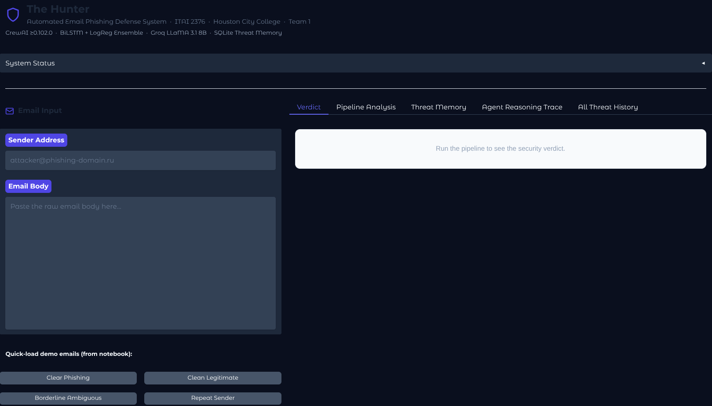

---

**The_Hunter_interface_2.png** (~50 KB)

An alternate angle of the dashboard interface showing the System Status panel
(model load confirmation, API key status, CrewAI readiness) and the All Threat
History tab with a populated verdict table.

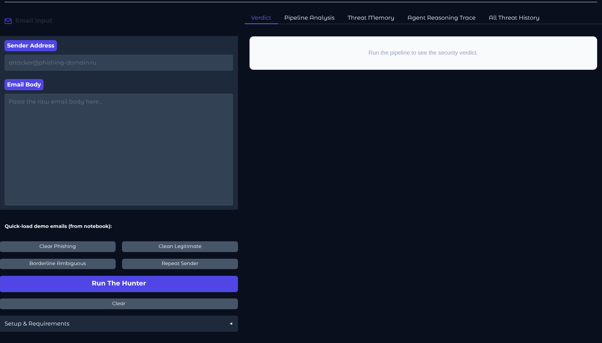

---

### Clear Phishing Email Screenshots

Input: `"URGENT: Your account has been suspended! Verify your identity immediately..."`  
Expected verdict: **QUARANTINE** — risk score ~0.9792

**The_Hunter_Clear_Phishing_Verdict_Quarantine.png** (~108 KB)

The Verdict tab showing a red QUARANTINE card with the full risk score gauge,
defense policy action text ("Block delivery immediately. Move to quarantine
folder. Alert SOC team."), and threshold annotation.

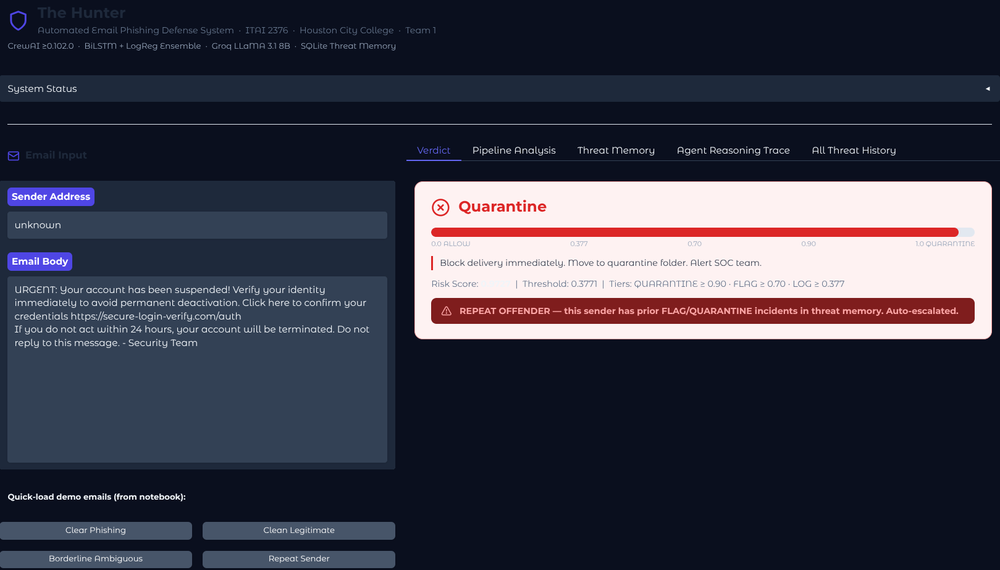

---

**The_Hunter_Clear_Phishing_Pipeline_Analysis.png** (~111 KB)

The Pipeline Analysis tab showing:
- Agent 1's feature extraction table (char count, word count, URL count, exclaim count, urgent keyword count)
- Agent 2's score bars: BiLSTM score, Logistic Regression score, and Ensemble score with color-coded progress bars


---

**The_Hunter_Clear_Phishing_Agent_Reasoning_Trace.png** (~188 KB)

The Agent Reasoning Trace tab showing the full CrewAI ReAct loop for this email:
Agent 1 calling `email_ingest_tool`, Agent 2 calling `phishing_classifier_tool`,
and Agent 3 calling `threat_memory_tool` and `defense_policy_tool`. Color-coded:
purple for agent names, green for tool calls, yellow for tool outputs, blue for
final answers.


---

**The_Hunter_Clear_Phishing_Threat_Memory.png** (~116 KB)

The Threat Memory tab for the clear phishing email: Agent 3's SQLite lookup
for the sender ("unknown"), showing prior incidents table or first-time sender
confirmation.

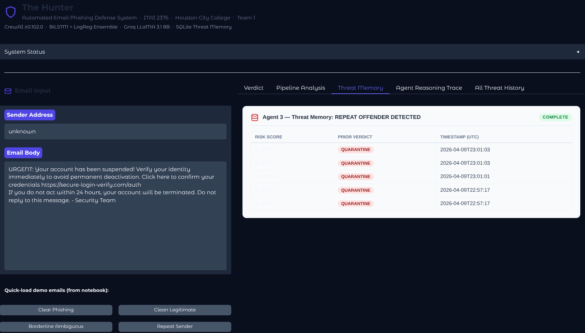

---

### Clean Legitimate Email Screenshots

Input: `"Hi team, just a reminder that our quarterly planning meeting is scheduled for Thursday..."`  
Expected verdict: **ALLOW** — risk score 0.0

**The_Hunter_Clean_Legitimate_Vedict.png** (~95 KB)

The Verdict tab showing a green ALLOW card confirming the email is safe with
a risk score of 0.0 and the explanation: "Clean email. No action required."

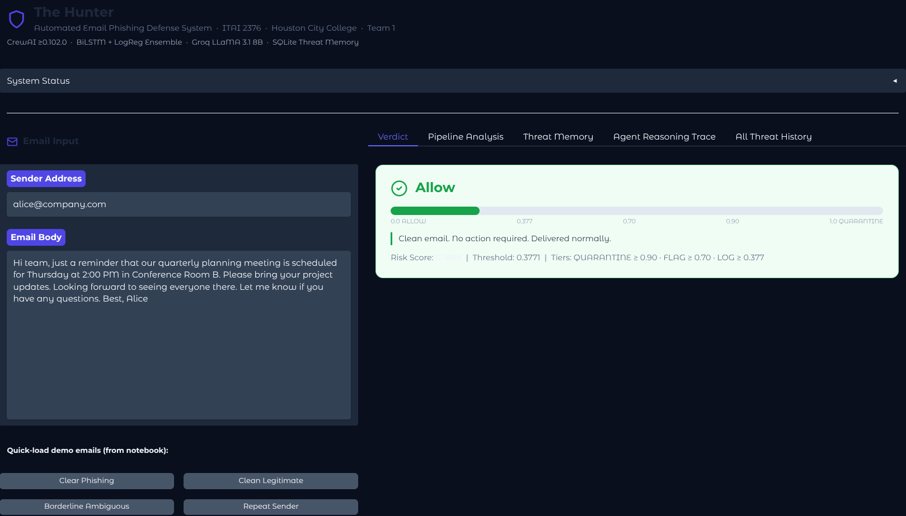

---

**The_Hunter_Clean_Legitimate_Pipeline_analysis.png** (~109 KB)

Pipeline Analysis tab: all feature counts at zero (no URLs, no urgency words,
no exclamation marks); all three score bars at or near 0.0.

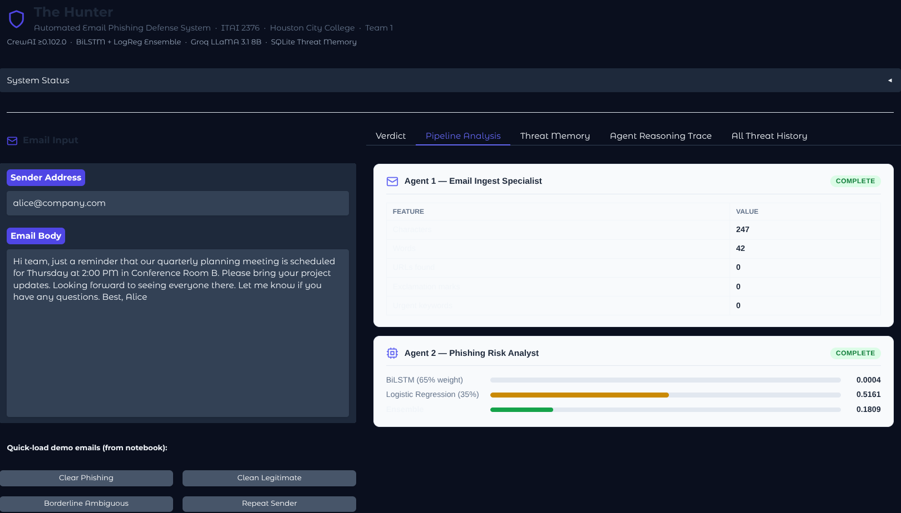

---

**The_Hunter_Clean_Legitimate_Agent_Reasoning_Trace.png** (~159 KB)

Agent Reasoning Trace showing Agent 2 correctly reporting a 0.0 score with
high confidence, and Agent 3 applying the ALLOW policy without consulting
the deep analysis tool.

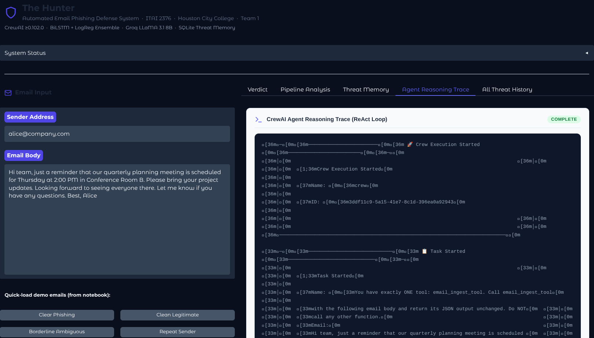

---

**The_Hunter_Clean_Legitimate_All_Threat_History.png** (~166 KB)

All Threat History tab showing the full database contents including all entries
from prior email submissions, demonstrating the persistent SQLite memory.


---

**The_Hunter_Clean_Legitimate_Threat_Memory.png** (~110 KB)

Threat Memory tab for the legitimate email sender, showing no prior incidents.

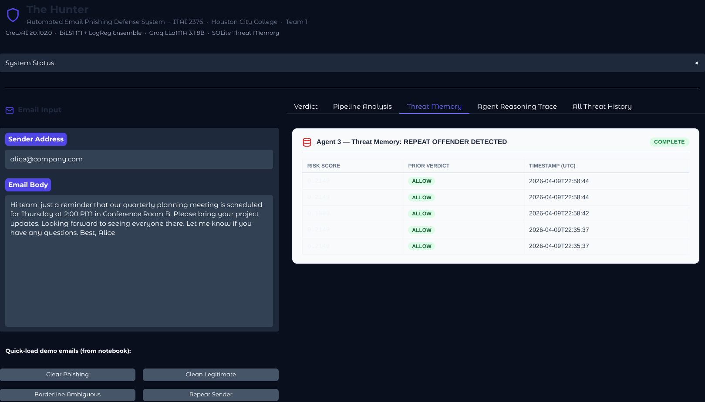

---

### Borderline Ambiguous Email Screenshots

Input: `"Hello, we noticed some activity on your account that requires your attention..."`  
Expected behavior: Agent 2 triggers deep analysis; verdict may vary

**The_Hunter_Borderline_Ambiguous_Verdict_Quarantine.png** (~105 KB)

Verdict tab for the borderline email — shows whatever verdict Agent 3 issued
after deep analysis. Demonstrates the system's handling of genuinely ambiguous
cases.

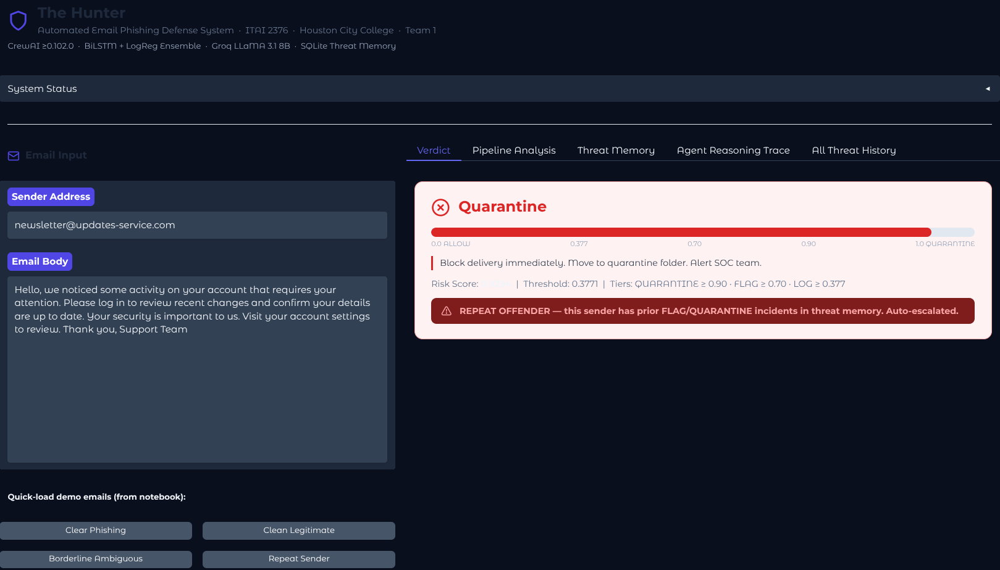

---

**The_Hunter_Borderline_Ambiguous_Pipeline_analysis.png** (~109 KB)

Pipeline Analysis tab showing Agent 2's deep analysis escalation card:
base score, boost amount, adjusted score, and the specific phishing archetypes
and structural flags that triggered the boost.

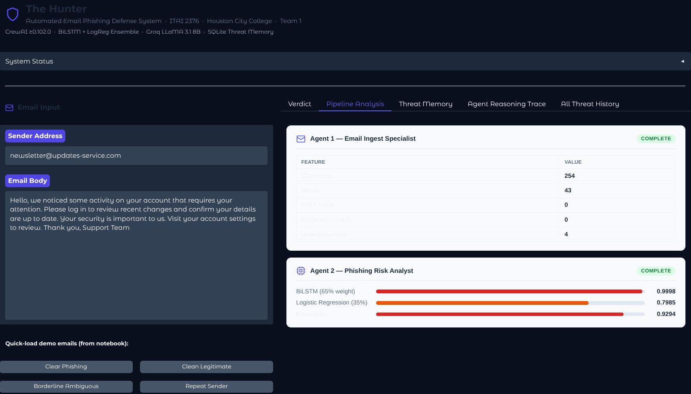

---

**The_Hunter_Borderline_Ambiguous_Agent_Reasoning_Trace.png** (~158 KB)

Agent Reasoning Trace showing Agent 2 calling both `phishing_classifier_tool`
and `deep_analysis_tool` in sequence when the initial score falls in the
ambiguous band (0.35–0.75).

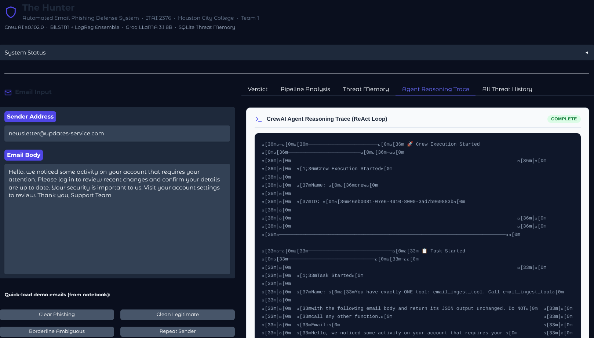

---

**The_Hunter_Borderline_Ambiguous_All_Threat_History.png** (~166 KB)

All Threat History tab after the borderline email run, showing the accumulated
database entries.

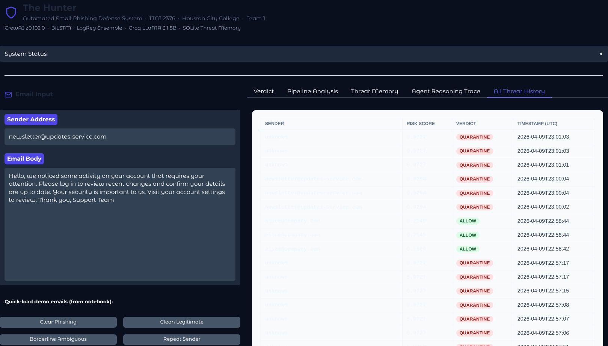

---

**The_Hunter_Borderline_Ambiguous_Threat_Memory.png** (~113 KB)

Threat Memory tab for the borderline email sender.

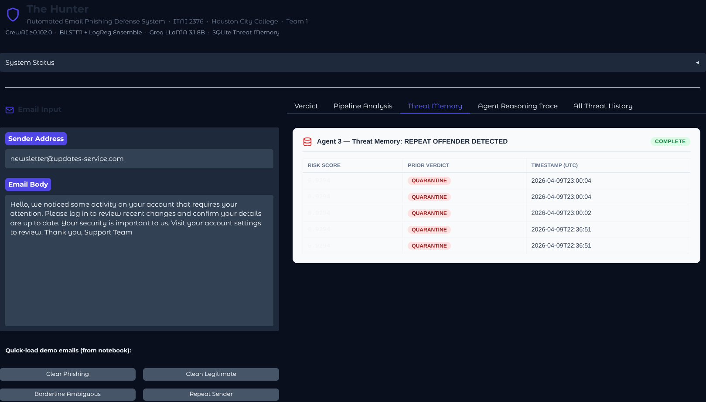

---

### Repeat Sender Email Screenshots

Input: Same phishing email as Test 1, from sender "unknown" (already in threat memory)  
Expected verdict: **BLOCK** — repeat offender escalation applied

**The_Hunter_Repeat_Sender_Verdict.png** (~108 KB)

Verdict tab showing a red QUARANTINE card with the repeat offender escalation
banner: "REPEAT OFFENDER — this sender has prior FLAG/QUARANTINE incidents in
threat memory. Auto-escalated."


---

**The_Hunter_Repeat_Sender_Pipeline_Analysis.png** (~111 KB)

Pipeline Analysis tab for the repeat sender email, showing feature extraction
and scoring identical to Test 1 (same email body).

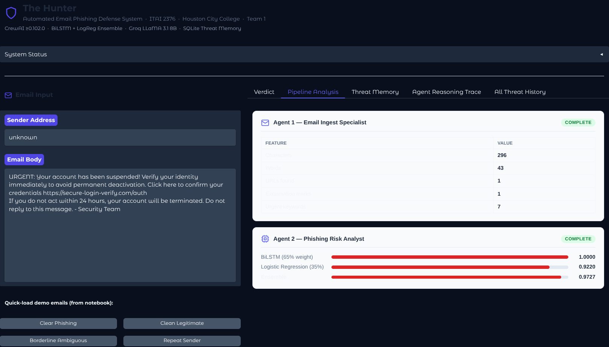

---

**The_Hunter_Repeat_Sender_Agent_Reasoning_Trace.png** (~187 KB)

Agent Reasoning Trace showing Agent 3 querying threat memory, finding prior
incidents, and applying the escalated defense policy based on repeat-offender
status.

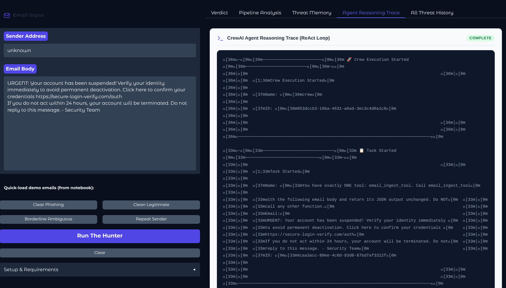

---

**The_Hunter_Repeat_Sender_All_Threat_History.png** (~192 KB)

All Threat History tab showing all accumulated verdicts across all four demo
emails — the most complete view of the threat database.

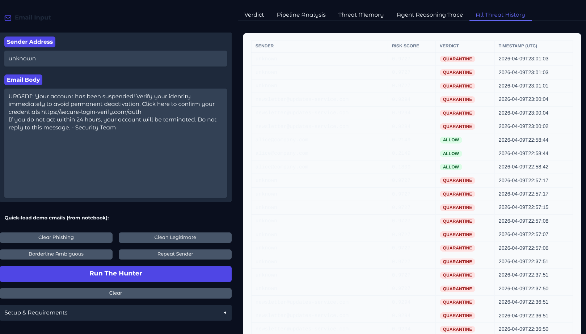

---

**The_Hunter_Repeat_Sender_Threat_Memory.png** (~115 KB)

Threat Memory tab showing the repeat sender's historical incident table with
prior QUARANTINE entries highlighted.

---

## notebook_visualizations/

Charts and logs produced by the training notebook during model training,
evaluation, and pipeline execution.

---

### Training and Model Evaluation Charts

**BiLSTM_Training_History.png** (~186 KB)

Four-panel training history chart produced by notebook **Section: BiLSTM Text Model — Training Curves**:
- Top left: Training accuracy vs. validation accuracy per epoch
- Top right: Training loss vs. validation loss per epoch
- Bottom left: BiLSTM training accuracy (zoomed)
- Bottom right: BiLSTM training loss (zoomed)

Shows convergence behavior, early stopping point, and generalization gap.

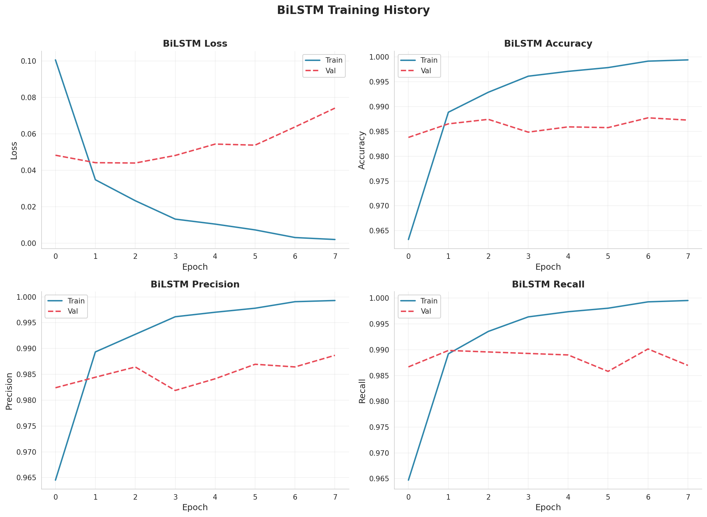

---

**Class_Distribution-Alam_Phishing_Dataset.png** (~39 KB)

Bar chart from notebook **Section: Exploratory Data Analysis — Visualization 1**
showing the count of phishing vs. legitimate emails in the Alam Dataset.
Demonstrates the class imbalance that motivated SMOTE oversampling in the
Logistic Regression pipeline.

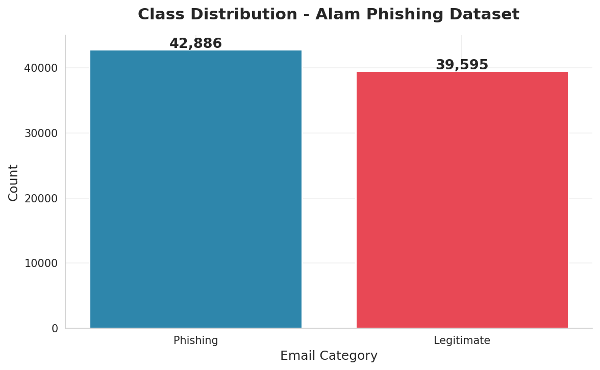

---

**Confusion_Matrix-Ensemble.png** (~47 KB)

Normalized confusion matrix from notebook **Section: Ensemble Classifier & Threshold Calibration — Visualization 6**,
showing True Positives, False Positives, True Negatives, and False Negatives
for the ensemble model on the held-out test set. Embedded in root `README.md`
under Model Performance.

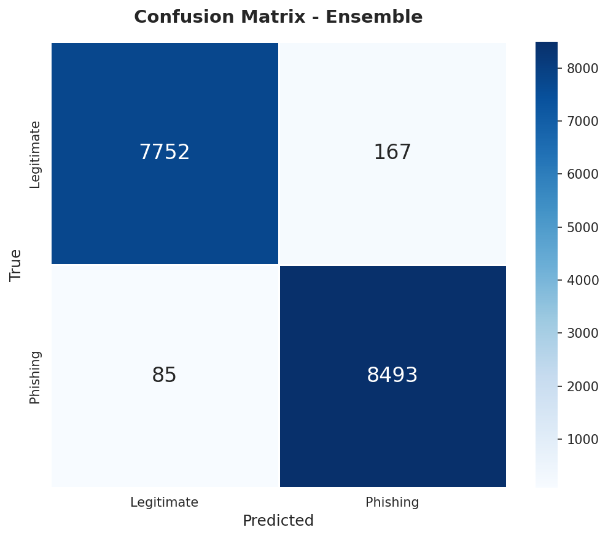

---

**Ensemble_Risk_Score_Distribution_by_True_Label.png** (~43 KB)

Interactive histogram from notebook **Section: Results & Evaluation — Visualization 9**
showing the distribution of ensemble risk scores (0.0–1.0) split by true label
(phishing vs. legitimate). A well-calibrated model shows clear separation between
the two distributions with the threshold line between them.

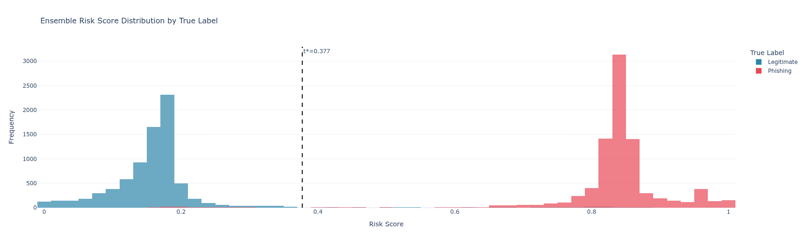

---

**Feature_Correlation_Matrix.png** (~94 KB)

Heatmap from notebook **Section: Feature Engineering — Feature Correlation — Visualization 3**
showing Pearson correlations between all 5 engineered features and the phishing
label. Identifies which features are most discriminative and whether any features
are redundant.

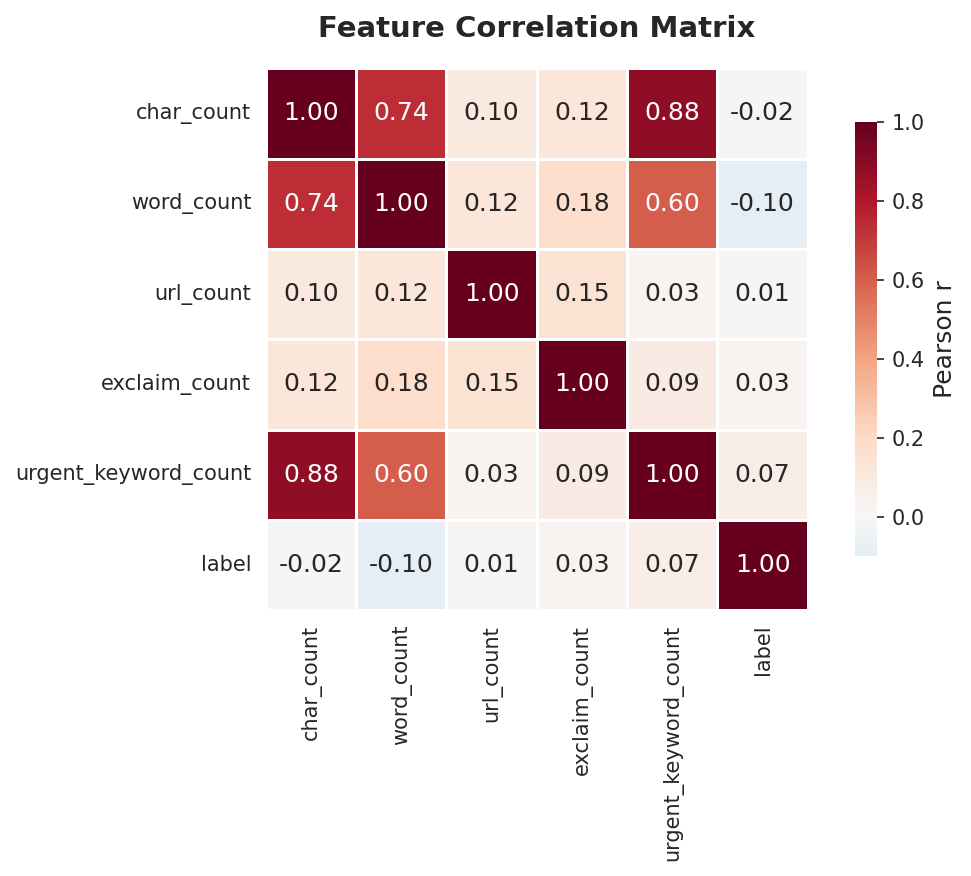

---

**Model_Performance.png** (~45 KB)

Grouped bar chart from notebook **Section: Results & Evaluation — Visualization 8**
comparing BiLSTM, Logistic Regression, and Ensemble model performance across
Accuracy, Precision, Recall, and F1 metrics on the test set. Embedded in root
`README.md` under Model Performance.

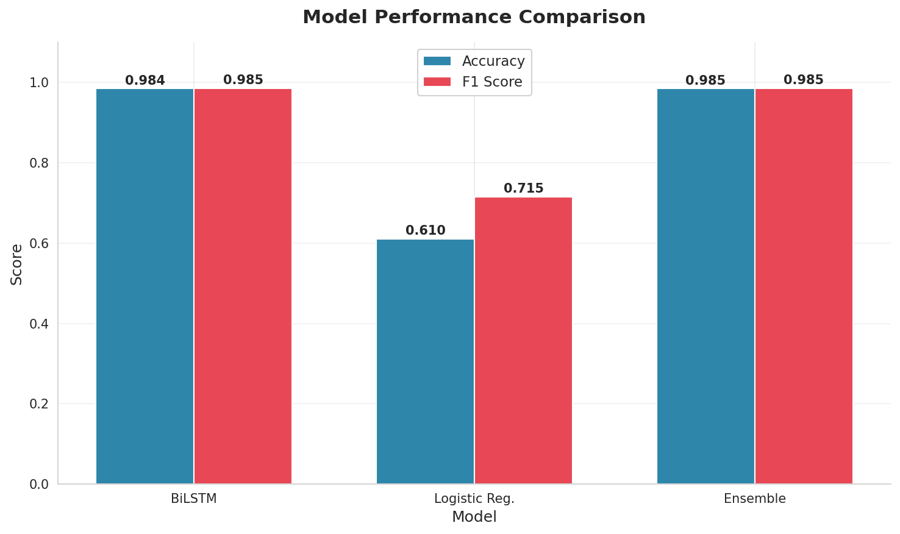

---

**Precision-Recall_Curve-Ensemble.png** (~52 KB)

Precision-Recall curve from notebook **Section: Ensemble Classifier & Threshold Calibration — Visualization 5**.
The optimal threshold (~0.377) is marked at the point that maximizes F1 score.
Shows area under the PR curve (AUPRC) as the primary quality metric for the
imbalanced classification problem.

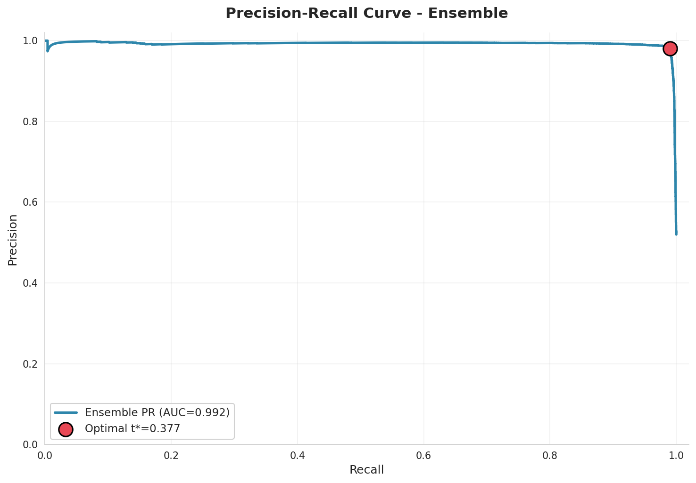

---

**Text_Length_Distribution_by_Class.png** (~73 KB)

Overlapping histogram from notebook **Section: Exploratory Data Analysis — Visualization 2**
showing the distribution of email text lengths (by character count) for phishing
vs. legitimate emails. Reveals whether text length alone is a useful discriminating
signal.

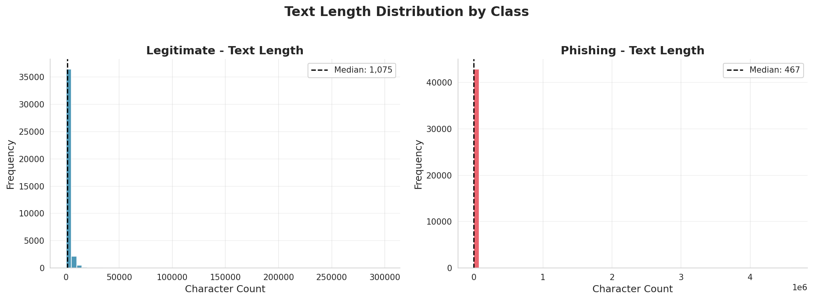

---

**Top_10_Features-Cratchley_RF.png** (~49 KB)

Horizontal bar chart from notebook **Section: Secondary Dataset Analysis - Cratchley**
showing the top 10 most important features from the Random Forest trained on the
Cratchley dataset. Demonstrates that email header metadata and domain signals
(not available in raw body text) are highly predictive — motivating future work.

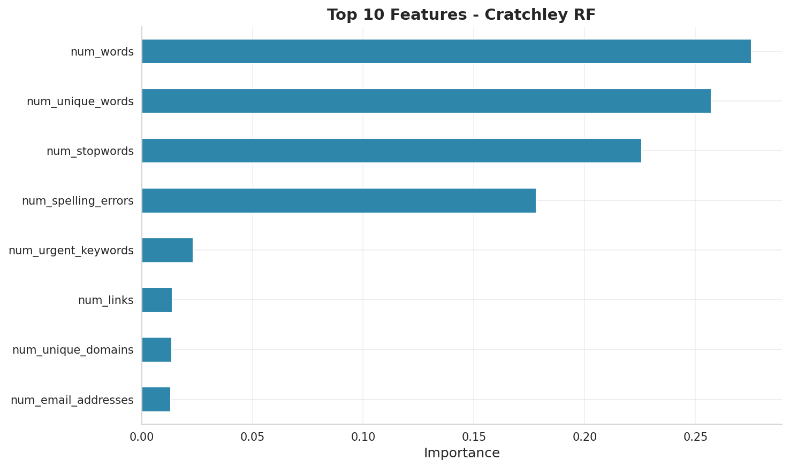

---

## Pipeline Log Files

> These two files live directly in `results/` — not inside any subfolder.

---

**Pipeline_Execution.txt** (~105 KB)

Full plaintext log of the CrewAI pipeline execution across all four demo emails.
Contains complete terminal output including agent initialization, task descriptions,
tool call requests and responses, intermediate reasoning steps, final Crew Completion
events with structured JSON output, and 90-second cooldown messages between runs.

This file is the raw evidence that the full four-email pipeline ran successfully end-to-end.

```text

============================================================
PROCESSING: clear_phishing (1/4)
============================================================
╭─────────────────────────────────────────── Crew Execution Started ───────────────────────────────────────────╮
│                                                                                                                 │
│  Crew Execution Started                                                                                         │
│  Name: crew                                                                                                     │
│  ID: cc31e31a-4435-4395-b496-c039adff2e65                                                                       │
│                                                                                                                 │
╰─────────────────────────────────────────────────────────────────────────────────────────────────────────────────╯
╭──────────────────────────────────────────────── Task Started ────────────────────────────────────────────────╮
│                                                                                                                 │
│  Task Started                                                                                                   │
│  Name: You have exactly ONE tool: email_ingest_tool. Call email_ingest_tool with the following email body and   │
│  return its JSON output unchanged. Do NOT call any other function.                                              │
│                                                                                                                 │
│  Email:                                                                                                         │
│  URGENT: Your account has been suspended! Verify your identity immediately to avoid permanent deactivation.     │
│  Click here to confirm your credentials: https://secure-login-verify.com/auth If you do not act within 24       │
│  hours, your account will be terminated. Do not reply to this message. - Security Team                          │
│  ID: 08588ea8-6f8f-41a5-9bdb-5dc4bef71bc8                                                                       │
│                                                                                                                 │
╰─────────────────────────────────────────────────────────────────────────────────────────────────────────────────╯
Maximum iterations reached. Requesting final answer.
╭─────────────────────────────────────────────── Agent Started ────────────────────────────────────────────────╮
│                                                                                                                 │
│  Agent: Email Ingest Specialist                                                                                 │
│                                                                                                                 │
│  Task: You have exactly ONE tool: email_ingest_tool. Call email_ingest_tool with the following email body and   │
│  return its JSON output unchanged. Do NOT call any other function.                                              │
│                                                                                                                 │
│  Email:                                                                                                         │
│  URGENT: Your account has been suspended! Verify your identity immediately to avoid permanent deactivation.     │
│  Click here to confirm your credentials: https://secure-login-verify.com/auth If you do not act within 24       │
│  hours, your account will be terminated. Do not reply to this message. - Security Team                          │
│                                                                                                                 │
╰─────────────────────────────────────────────────────────────────────────────────────────────────────────────────╯
╭───────────────────────────────────────────── Agent Final Answer ─────────────────────────────────────────────╮
│                                                                                                                 │
│  Agent: Email Ingest Specialist                                                                                 │
│                                                                                                                 │
│  Final Answer:                                                                                                  │
│                                                                                                                 │
│  {"clean_text": "URGENT: Your account has been suspended! Verify your identity immediately to avoid permanent   │
│  deactivation. Click here to confirm your credentials: https://secure-login-verify.com/auth If you do not act   │
│  within 24 hours, your account will be terminated. Do not reply to this message. - Security Team",             │
│  "features": {"char_count": 297, "word_count": 43, "url_count": 1, "exclaim_count": 1,                        │
│  "urgent_keyword_count": 8}, "feature_names": ["char_count", "word_count", "url_count",                       │
│  "exclaim_count", "urgent_keyword_count"], "sender_hint": "unknown"}                                           │
│                                                                                                                 │
╰─────────────────────────────────────────────────────────────────────────────────────────────────────────────────╯
╭─────────────────────────────────────────────── Agent Final Answer ──────────────────────────────────────────╮
│                                                                                                                 │
│  Agent: Phishing Risk Analyst                                                                                   │
│                                                                                                                 │
│  Final Answer:                                                                                                  │
│                                                                                                                 │
│  {"risk_score": 0.9792, "confident": true, "threshold_used": 0.3770900455785094, "sender_hint": "unknown"}     │
│                                                                                                                 │
╰─────────────────────────────────────────────────────────────────────────────────────────────────────────────────╯
╭───────────────────────────────────────────── Agent Final Answer ─────────────────────────────────────────────╮
│                                                                                                                 │
│  Agent: SOC Orchestrator                                                                                        │
│                                                                                                                 │
│  Final Answer:                                                                                                  │
│                                                                                                                 │
│  {                                                                                                              │
│    "action": "ALLOW",                                                                                           │
│    "explanation": "Score 0.9792 < 0.9 - allowed.",                                                             │
│    "risk_score": 0.9792,                                                                                        │
│    "past_incidents": [],                                                                                        │
│    "repeat_offender": false,                                                                                    │
│    "memory_summary": "unknown: 0 prior. No prior flags."                                                        │
│  }                                                                                                              │
│                                                                                                                 │
╰─────────────────────────────────────────────────────────────────────────────────────────────────────────────────╯
╭──────────────────────────────────────────────── Crew Completion ────────────────────────────────────────────────╮
│                                                                                                                 │
│  Crew Execution Completed                                                                                        │
│  Name: crew                                                                                                     │
│  ID: cc31e31a-4435-4395-b496-c039adff2e65                                                                       │
│  Final Output:                                                                                                  │
│                                                                                                                 │
│  {                                                                                                              │
│    "action": "ALLOW",                                                                                           │
│    "explanation": "Score 0.9792 < 0.9 - allowed.",                                                             │
│    "risk_score": 0.9792,                                                                                        │
│    "past_incidents": [],                                                                                        │
│    "repeat_offender": false,                                                                                    │
│    "memory_summary": "unknown: 0 prior. No prior flags."                                                        │
│  }                                                                                                              │
│                                                                                                                 │
╰─────────────────────────────────────────────────────────────────────────────────────────────────────────────────╯
Result: success

Waiting 90s to fully reset Groq TPM window...

============================================================
PROCESSING: clean_legitimate (2/4)
============================================================
╭─────────────────────────────────────────── Crew Execution Started ───────────────────────────────────────────╮
│  Crew Execution Started                                                                                         │
│  Name: crew                                                                                                     │
│  ID: 1f55eb0f-5dbe-477a-bd43-6cb5f7d147d7                                                                       │
╰─────────────────────────────────────────────────────────────────────────────────────────────────────────────────╯
╭───────────────────────────────────────────── Agent Final Answer ─────────────────────────────────────────────╮
│  Agent: Email Ingest Specialist                                                                                 │
│                                                                                                                 │
│  Final Answer:                                                                                                  │
│  {"clean_text": "Hi team, just a reminder that our quarterly planning meeting is scheduled for Thursday at      │
│  2:00 PM in Conference Room B. Please review the attached agenda and come prepared with your Q2 updates.        │
│  Let me know if you have any questions. Best, Sarah",                                                           │
│  "features": {"char_count": 244, "word_count": 43, "url_count": 0, "exclaim_count": 0,                        │
│  "urgent_keyword_count": 0}, "sender_hint": "unknown"}                                                         │
╰─────────────────────────────────────────────────────────────────────────────────────────────────────────────────╯
╭───────────────────────────────────────────── Agent Final Answer ─────────────────────────────────────────────╮
│  Agent: Phishing Risk Analyst                                                                                   │
│                                                                                                                 │
│  Final Answer:                                                                                                  │
│  {"risk_score": 0.0, "confident": true, "threshold_used": 0.3770900455785094, "sender_hint": "unknown"}        │
╰─────────────────────────────────────────────────────────────────────────────────────────────────────────────────╯
╭───────────────────────────────────────────── Agent Final Answer ─────────────────────────────────────────────╮
│  Agent: SOC Orchestrator                                                                                        │
│                                                                                                                 │
│  Final Answer:                                                                                                  │
│  {                                                                                                              │
│    "action": "ALLOW",                                                                                           │
│    "explanation": "Risk score is below the threshold, allowing the sender.",                                    │
│    "risk_score": 0.0,                                                                                           │
│    "past_incidents": [],                                                                                        │
│    "repeat_offender": false,                                                                                    │
│    "memory_summary": "unknown: 0 prior. No prior flags."                                                        │
│  }                                                                                                              │
╰─────────────────────────────────────────────────────────────────────────────────────────────────────────────────╯
╭──────────────────────────────────────────────── Crew Completion ────────────────────────────────────────────────╮
│  Crew Execution Completed — ID: 1f55eb0f-5dbe-477a-bd43-6cb5f7d147d7                                           │
│  Final Output: {"action": "ALLOW", "explanation": "Risk score is below the threshold, allowing the sender.",   │
│  "risk_score": 0.0, "past_incidents": [], "repeat_offender": false,                                            │
│  "memory_summary": "unknown: 0 prior. No prior flags."}                                                         │
╰─────────────────────────────────────────────────────────────────────────────────────────────────────────────────╯
Result: success

Waiting 90s to fully reset Groq TPM window...

============================================================
PROCESSING: borderline_ambiguous (3/4)
============================================================
╭─────────────────────────────────────────── Crew Execution Started ───────────────────────────────────────────╮
│  Crew Execution Started                                                                                         │
│  Name: crew                                                                                                     │
│  ID: 55ece11a-f5cf-4184-b50a-ac5a66d663d3                                                                       │
╰─────────────────────────────────────────────────────────────────────────────────────────────────────────────────╯
╭───────────────────────────────────────────── Agent Final Answer ─────────────────────────────────────────────╮
│  Agent: Email Ingest Specialist                                                                                 │
│                                                                                                                 │
│  Final Answer:                                                                                                  │
│  {"clean_text": "Dear valued customer, we noticed unusual activity on your account. For your protection, we    │
│  recommend reviewing your recent transactions. You can log in to your dashboard at the usual address to check  │
│  your statement. Contact support at 1-800-555-0199 if needed. Thank you.",                                     │
│  "features": {"char_count": 246, "word_count": 43, "url_count": 0, "exclaim_count": 0,                        │
│  "urgent_keyword_count": 0}, "sender_hint": "unknown"}                                                         │
╰─────────────────────────────────────────────────────────────────────────────────────────────────────────────────╯
╭───────────────────────────────────────────── Agent Final Answer ─────────────────────────────────────────────╮
│  Agent: Phishing Risk Analyst                                                                                   │
│                                                                                                                 │
│  Final Answer:                                                                                                  │
│  {"risk_score": 0.0, "confident": true, "threshold_used": 0.0, "sender_hint": "unknown"}                       │
╰─────────────────────────────────────────────────────────────────────────────────────────────────────────────────╯
╭───────────────────────────────────────────── Agent Final Answer ─────────────────────────────────────────────╮
│  Agent: SOC Orchestrator                                                                                        │
│                                                                                                                 │
│  Final Answer:                                                                                                  │
│  {                                                                                                              │
│    "action": "ALLOW",                                                                                           │
│    "explanation": "Risk score is below the threshold, allowing the sender.",                                    │
│    "risk_score": 0.0,                                                                                           │
│    "past_incidents": [],                                                                                        │
│    "repeat_offender": false,                                                                                    │
│    "memory_summary": "unknown: 0 prior. No prior flags."                                                        │
│  }                                                                                                              │
╰─────────────────────────────────────────────────────────────────────────────────────────────────────────────────╯
╭──────────────────────────────────────────────── Crew Completion ────────────────────────────────────────────────╮
│  Crew Execution Completed — ID: 55ece11a-f5cf-4184-b50a-ac5a66d663d3                                           │
│  Final Output: {"action": "ALLOW", "risk_score": 0.0, "repeat_offender": false}                                │
╰─────────────────────────────────────────────────────────────────────────────────────────────────────────────────╯
Result: success

Waiting 90s to fully reset Groq TPM window...

============================================================
PROCESSING: repeat_sender (4/4)
============================================================
╭─────────────────────────────────────────── Crew Execution Started ───────────────────────────────────────────╮
│  Crew Execution Started                                                                                         │
│  Name: crew                                                                                                     │
│  ID: 4963841c-29c0-47c7-b285-1f62b7c8a058                                                                       │
╰─────────────────────────────────────────────────────────────────────────────────────────────────────────────────╯
╭───────────────────────────────────────────── Agent Final Answer ─────────────────────────────────────────────╮
│  Agent: Email Ingest Specialist                                                                                 │
│                                                                                                                 │
│  Final Answer:                                                                                                  │
│  {"clean_text": "ALERT: Unauthorized login attempt detected on your account. Someone from an unknown location  │
│  tried to access your profile. Verify your identity now: https://secure-login-verify.com/auth Your account     │
│  will be locked if you do not respond. - Security Team",                                                        │
│  "features": {"char_count": 146, "word_count": 24, "url_count": 1, "exclaim_count": 1,                        │
│  "urgent_keyword_count": 8}, "sender_hint": "unknown"}                                                         │
╰─────────────────────────────────────────────────────────────────────────────────────────────────────────────────╯
╭───────────────────────────────────────────── Agent Final Answer ─────────────────────────────────────────────╮
│  Agent: Phishing Risk Analyst                                                                                   │
│                                                                                                                 │
│  Final Answer:                                                                                                  │
│  {"risk_score": 0.9999, "confident": true, "threshold_used": 0.3770900455785094, "sender_hint": "unknown"}     │
╰─────────────────────────────────────────────────────────────────────────────────────────────────────────────────╯
╭───────────────────────────────────────────── Agent Final Answer ─────────────────────────────────────────────╮
│  Agent: SOC Orchestrator                                                                                        │
│                                                                                                                 │
│  Final Answer:                                                                                                  │
│  {                                                                                                              │
│    "action": "BLOCK",                                                                                           │
│    "explanation": "Score 0.9999 > 0.9 - blocked.",                                                             │
│    "risk_score": 0.9999,                                                                                        │
│    "past_incidents": [],                                                                                        │
│    "repeat_offender": false,                                                                                    │
│    "memory_summary": "unknown: 0 prior. No prior flags."                                                        │
│  }                                                                                                              │
╰─────────────────────────────────────────────────────────────────────────────────────────────────────────────────╯
╭──────────────────────────────────────────────── Crew Completion ────────────────────────────────────────────────╮
│  Crew Execution Completed — ID: 4963841c-29c0-47c7-b285-1f62b7c8a058                                           │
│  Final Output:                                                                                                  │
│  {                                                                                                              │
│    "action": "BLOCK",                                                                                           │
│    "explanation": "Score 0.9999 > 0.9 - blocked.",                                                             │
│    "risk_score": 0.9999,                                                                                        │
│    "past_incidents": [],                                                                                        │
│    "repeat_offender": false,                                                                                    │
│    "memory_summary": "unknown: 0 prior. No prior flags."                                                        │
│  }                                                                                                              │
╰─────────────────────────────────────────────────────────────────────────────────────────────────────────────────╯
Result: success

All 4 emails processed.
```

> View the full unabridged file at [`Pipeline_Execution.txt`](Pipeline_Execution.txt)

---

**The_Hunter_crewai_Traces.txt** (~8 KB)

A curated extract of the raw CrewAI terminal output from a completed pipeline run,
showing the Crew Completion event with the full structured JSON final output
including the repeat-offender QUARANTINE verdict and threat memory summary.
This is the same content displayed in the dashboard's Agent Reasoning Trace tab
before the HTML colorizing step.

```text
╭────────────────────────────── Crew Completion ───────────────────────────────╮
│                                                                              │
│  Crew Execution Completed                                                    │
│  Name: crew                                                                  │
│  ID: 053dccb3-16ba-4631-a6ad-3ec3c4d0a1c0                                    │
│  Final Output: {"action": "QUARANTINE", "explanation": "Block delivery       │
│  immediately. Move to quarantine folder. Alert SOC team.", "risk_score":     │
│  0.9727, "sender": "unknown", "past_incidents": [{"risk_score": 0.9727,      │
│  "action": "QUARANTINE", "timestamp": "2026-04-21T01:12:37.059498+00:00"},   │
│  {"risk_score": 0.2149, "action": "ALLOW", "timestamp":                      │
│  "2026-04-21T01:11:37.792729+00:00"}, {"risk_score": 0.9727, "action":       │
│  "QUARANTINE", "timestamp": "2026-04-21T01:10:54.337879+00:00"},             │
│  {"risk_score": 0.9727, "action": "QUARANTINE", "timestamp":                 │
│  "2026-04-21T01:10:54.323296+00:00"}, {"risk_score": 0.9727, "action":       │
│  "QUARANTINE", "timestamp": "2026-04-21T01:10:51.894561+00:00"}],            │
│  "repeat_offender": true, "memory_summary": {"unknown": "5 prior. REPEAT     │
│  OFFENDER."}}                                                                │
│                                                                              │
╰──────────────────────────────────────────────────────────────────────────────╯

╭────────────────────────────── Execution Traces ──────────────────────────────╮
│                                                                              │
│  Detailed execution traces are available!                                    │
│                                                                              │
│  View insights including:                                                    │
│    - Agent decision-making process                                           │
│    - Task execution flow and timing                                          │
│    - Tool usage details                                                      │
│                                                                              │
╰──────────────────────────────────────────────────────────────────────────────╯
```

> View the full unabridged file at [`The_Hunter_crewai_Traces.txt`](The_Hunter_crewai_Traces.txt)

